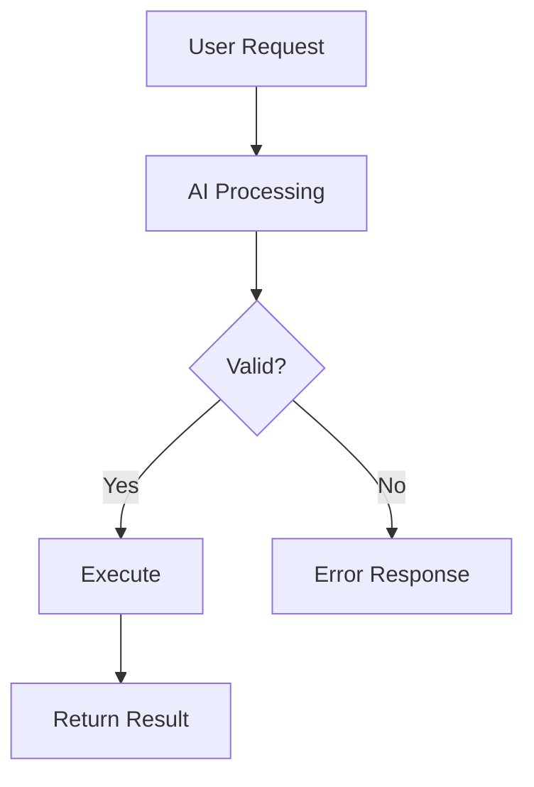

# Chat & Sessions

Real-time chat interface for interacting with AI agents.

## Starting a Session

1. Select a repository from the sidebar
2. Click **New Session** or type `/new`
3. Type your message in the input field
4. Press **Enter** to send

Each session maintains its own conversation history and context.

## Real-time Streaming

Messages stream in real-time using Server-Sent Events (SSE):

- See responses as they're generated
- No waiting for complete responses
- Can interrupt generation if needed

## Slash Commands

Type `/` to see available commands:

### Built-in Commands

| Command | Description |
|---------|-------------|
| `/help` | Show available commands |
| `/new` | Start a new session |
| `/models` | List available AI models |
| `/export` | Export session history |
| `/compact` | Compact session context |
| `/clear` | Clear current session |

### Custom Commands

Create your own commands in **Settings > Custom Commands**:

```yaml
name: review
description: Request a code review
template: |
  Please review the following code for:
  - Security vulnerabilities
  - Performance issues
  - Best practices
  - Code style
  
  {{selection}}
```

Use with `/review` in chat.

#### Template Variables

| Variable | Description |
|----------|-------------|
| `{{selection}}` | Currently selected text |
| `{{file}}` | Current file path |
| `{{clipboard}}` | Clipboard contents |

## File Mentions

Reference files in your prompts with `@`:

1. Type `@` in the chat input
2. Start typing a filename
3. Select from the autocomplete dropdown
4. The file reference is inserted

When you send the message, the AI has access to that file's contents.

### Multiple Files

You can mention multiple files in one message:

```
@src/components/Button.tsx @src/styles/button.css
Can you refactor the Button component to use CSS modules?
```

### Folder Mentions

Mention entire folders to include all files:

```
@src/utils/
Review all utility functions for consistency
```

## Plan/Build Mode

Toggle between two operational modes:

### Plan Mode (Read-Only)

- AI can read and analyze files
- AI cannot modify, create, or delete files
- Safe for exploration and planning

### Build Mode (Full Access)

- AI can create new files
- AI can edit existing files
- AI can delete files
- Use for implementation tasks

Toggle modes using the mode selector in the chat header.

## Mermaid Diagrams

AI responses can include Mermaid diagrams that render automatically:



Supported diagram types:

- Flowcharts
- Sequence diagrams
- Class diagrams
- State diagrams
- Entity-relationship diagrams
- Gantt charts
- And more...

## Session Management

### Viewing Sessions

Access your sessions from the sidebar:

- Sessions are organized by repository
- Most recent sessions appear first
- Click a session to resume

### Searching Sessions

Find sessions by content:

1. Click the search icon in the sessions panel
2. Type your search query
3. Results show sessions with matching content

### Deleting Sessions

Remove sessions you no longer need:

1. Hover over a session
2. Click the delete icon
3. Confirm deletion

### Bulk Delete

Remove multiple sessions at once:

1. Click **Select** in the sessions panel
2. Check sessions to delete
3. Click **Delete Selected**
4. Confirm deletion

## Context Management

Sessions maintain context of your conversation. As context grows, you may need to manage it:

### Compacting Context

Use `/compact` to reduce context size:

- Summarizes earlier messages
- Preserves important information
- Frees up context for new messages

### Starting Fresh

Use `/new` to start a new session when:

- Context is too large
- Topic has changed significantly
- You want a clean slate

## Keyboard Shortcuts

| Shortcut | Action |
|----------|--------|
| `Enter` | Send message |
| `Shift+Enter` | New line in message |
| `↑` | Edit last message |
| `/` | Open command menu |
| `@` | Open file mention menu |
| `Escape` | Close autocomplete menus |
