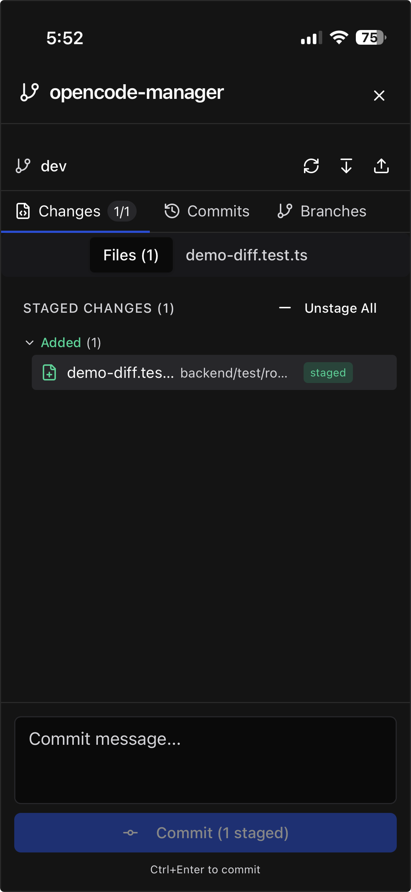
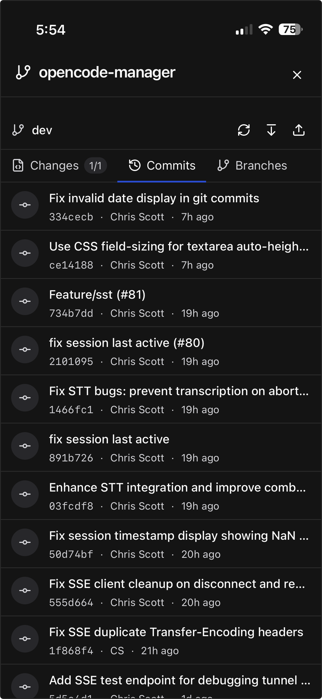
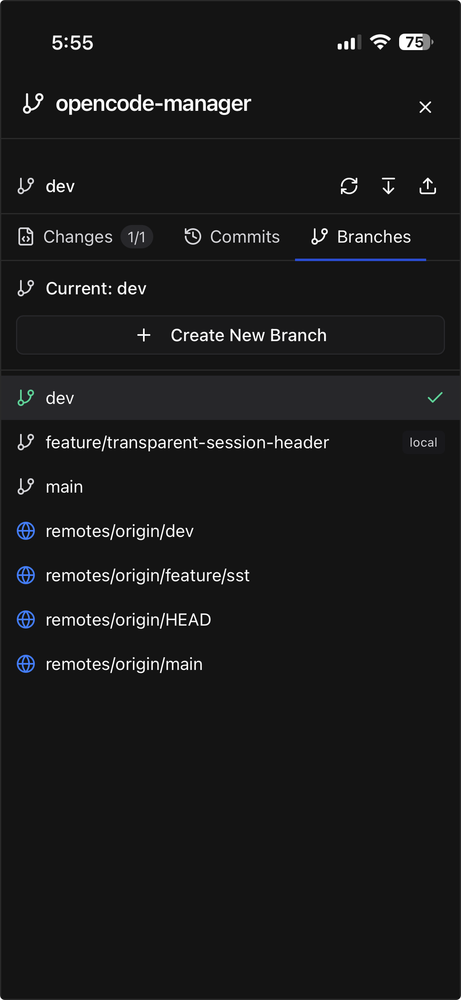
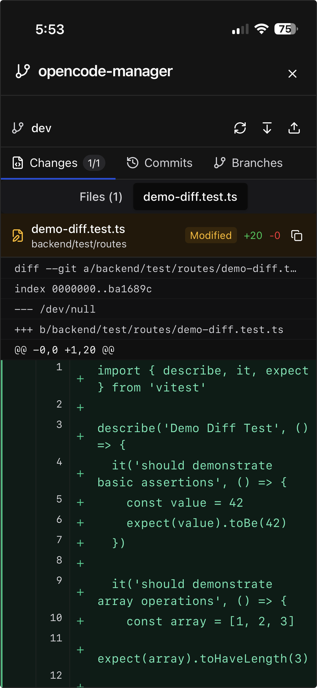

# Repository & Git

Comprehensive git integration for managing repositories and source control.

## Cloning Repositories

Clone any git repository:

1. Click the **Repositories** button in the sidebar
2. Click **Clone Repository**
3. Paste the repository URL
4. Click **Clone**

### Private Repositories

For private repositories, configure a GitHub Personal Access Token:

1. Go to **Settings > Credentials**
2. Enter your GitHub PAT
3. Ensure the token has `repo` scope

## Git Worktrees

Work on multiple branches simultaneously without switching:

1. Select a repository
2. Click **Create Worktree**
3. Enter branch name
4. A new workspace is created with that branch checked out

Worktrees share the same git history but have independent working directories. This is useful for:

- Comparing implementations across branches
- Working on a feature while keeping main branch accessible
- Testing changes without disrupting your main work

## Source Control Panel

Access comprehensive git operations via the source control button.

### Changes Tab

- View all modified, added, deleted, and untracked files
- Stage/unstage individual files or all changes
- Discard changes to revert modifications
- View diffs inline for any changed file

### Commits Tab

- Browse commit history
- View commit details including message, author, and date
- See file changes in each commit
- Track ahead/behind status with remote

### Branches Tab

- List all local and remote branches
- Create new branches from current HEAD
- Switch branches (checks out the branch)
- Delete local branches

## Diff Viewer

View file changes with a unified diff format:

- **Line Numbers** - Both old and new line numbers displayed
- **Syntax Highlighting** - Code is highlighted based on file type
- **Change Markers** - Additions in green, deletions in red
- **Change Counts** - Summary of lines added/removed

### Accessing Diffs

- Click any changed file in the Source Control panel
- Diffs appear inline or in a modal depending on context
- Use the expand/collapse toggle for large diffs

## Repository Actions

### Pull

Fetch and merge remote changes:

1. Select a repository
2. Click the **Pull** button
3. Changes are fetched and merged

### Fetch

Download remote changes without merging:

1. Select a repository
2. Click the **Fetch** button
3. Remote tracking branches are updated

### Delete Repository

Remove a repository from the workspace:

1. Select a repository
2. Click **Delete**
3. Confirm deletion

## Ahead/Behind Tracking

The UI shows your branch's relationship to its remote:

- **↑ N** - You have N commits not pushed to remote
- **↓ N** - Remote has N commits you haven't pulled
- **↑ N ↓ M** - Both local and remote have diverged

